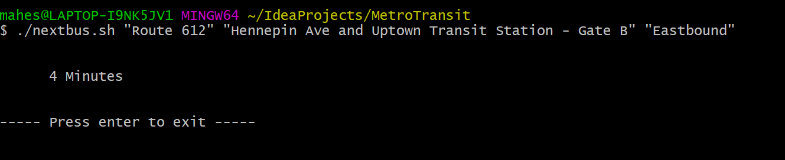
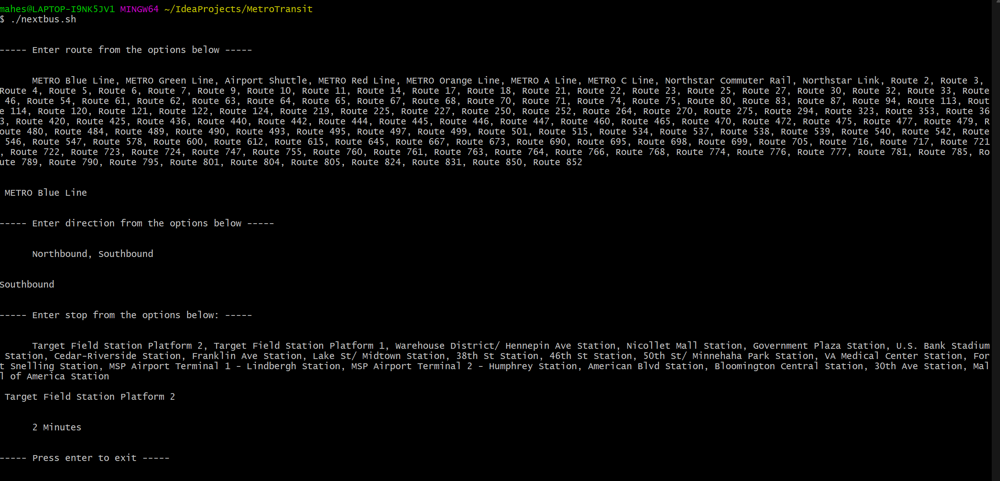
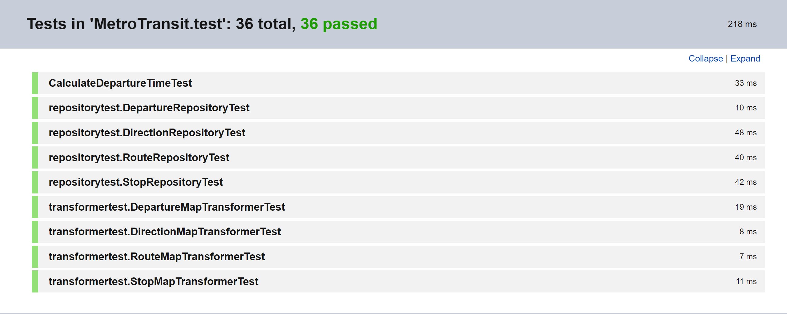

# MetroTransit

MetroTransit is a console application written in kotlin

Application which will tell you how long it is until the next bus on “BUS ROUTE” leaving from “BUS STOP NAME” going “DIRECTION” 
using the api defined at [Metro Transit](https://svc.metrotransit.org/swagger/index.html)

This project will use the [Retrofit](https://square.github.io/retrofit/) is a type-safe HTTP client and [Moshi](https://square.github.io/moshi/1.x/moshi/)
is a modern Json library, it makes it easy for parse Json into kotlin/java class

# How to run

1. Build the project using the include gradle script: build
2. Once build is complete, make sure the jar is generated in the path "{project_path}/build/libs/MetroTransit-1.0-SNAPSHOT.jar"
3. Goto terminal and change to the project path
4. Run th include shell script "nextbus.sh" with arguments

# How to use the nextbus.sh

./nextbus.sh "{Bus Route}" "{Bus Stop Name}" "{Direction}"

#### Example:
./nextbus.sh "METRO Blue Line" "Target Field Station Platform 1" "Southbound"

# ScreenShots

